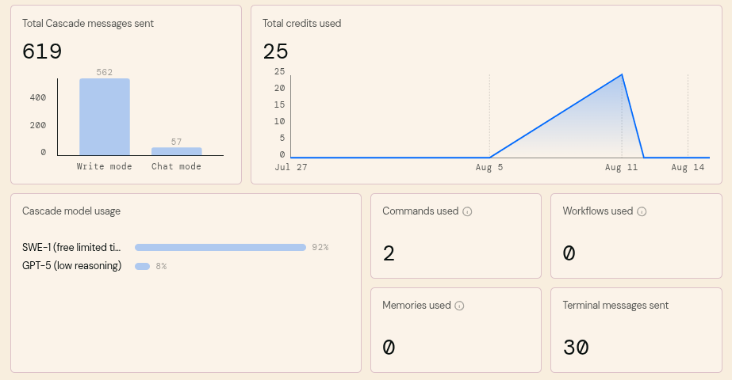
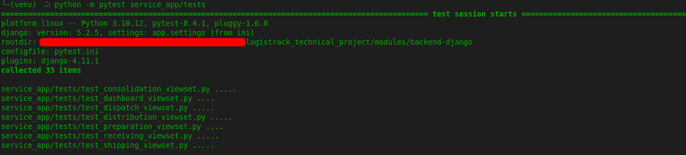

# 📘 Documentación del Proyecto

## 🔗 Links

* 📄 [README.md](./README.md) → Documentación principal del Proyecto.
* 🤖 [IA INTERACCIONES.md](./IA_INTERACCIONES.md) → Guía de interacciones con agentes de IA en el proyecto.

---

## 📑 Índice

1. [Introducción](#-introducción)
2. [Requerimientos Funcionales (5 días)](#-requerimientos-funcionales-5-días)
3. [Arquitectura del Proyecto](#arquitectura-del-proyecto)
4. [Agentes AI utilizados](#agentes-ai-utilizados)
5. [Retos encontrados (Soluciones)](#retos-encontrados-soluciones)
5. [Rutas de la API REST](#rutas-de-la-api-rest)
6. [Flujo de Procesos](#flujo-de-procesos) 
7. [Pruebas Unitarias](#pruebas-unitarias) 

---

## 📖 Introducción


Este documento describe la arquitectura, los componentes principales y el flujo de trabajo del proyecto. Está orientado a desarrolladores y colaboradores que deseen comprender, mantener y mejorar la solución. El proyecto se desarrolló usando [Git Flow](https://www.atlassian.com/git/tutorials/comparing-workflows/gitflow-workflow) para mantener la coherencia entre las ramas [main, develop, features]

---

## 📌 Requerimientos Funcionales (5 días)

Para el logro exitoso y profesional del proyecto, el programador realizó un levantamiento de requerimientos funcionales trazando por días los objetivos propuestas en las tareas. Estos requerimientos ayudaron a organizar la implementación de los flujos para cada microservicio.

1. **(Día 1) – Infraestructura + Base de Datos**
    * **Docker & entorno**
        * Crear `docker-compose.yml` con Symfony, Django, Angular, Redis y MySQL.
        * Configurar redes internas y volúmenes.
    * **Repositorios y versionado**
        * Estructura `/backend-symfony`, `/backend-django`, `/frontend-angular`.
        * `.gitignore` y convención de ramas.
    * **Base de datos**
        * Diseñar modelo ERD inicial (Orden, Bloque, Chofer, Producto).
        * Migraciones en Django y Symfony.
    * **Seeds**
        * Generar scripts dentro de los mismos framewaorks para las entidades del negocio.
        * Probar carga en MySQL.
2. **(Día 2) – Symfony (eventos en Redis)**
    * **Eventos Symfony**
        * Implementar y publicar en Redis (Stream o Pub/Sub).
    * **Validaciones**
        * Verificar las órdenes consolidadas existentes antes de publicar.
    * **Script CLI**
        * Implementar Comando en Symfony para insertar las órdenes consolidadas existentes en pruebas de streams con Redis.
3. **(Día 3) – Django (microservicio + API + validaciones)**
    * **Consumo de Redis**
        * Implementar Comando para leer eventos y guardarlos en MySQL.
    * **Modelos Django**
        * Generar el resto de los modelos y entidades del servicio.
    * **API REST**
        * Crear los viewsets y las clases que participan en el flujo del servicio.
    * **Documentación**
        * Swagger/OpenAPI generado con `drf-spectacular`.
    * **Pruebas Django**
        * Unitarias con `pytest-django`.
        * Prueba de integración: leer de Redis → guardar en BD → consultar vía API.
4. **(Día 4) – Angular (UI + Servicios + Visualización)**
    * **Setup Angular**
        * Módulos/Componentes: 
            * `dispatch (despacho)`
            * `preparation (preparacion)`
            * `shipping (expedicion)`
            * `receiving (recepcion)`
            * `consolidation (consolidacion)`
            * `distribution (distribucion)`.
        * Configuración de rutas.
    * **Servicios Angular**
        * Implementar los servicios con el framework → consumo directo de APIs Django.
    * **Pantallas UI (con Angular Material)**
        * **Despacho**: tabla con órdenes (filtro por CD/pyme).
        * **Preparación**: listado con estado, peso, volumen.
        * **Expedición**: tabla con chofer asignado y fecha.
        * **Recepción**: tabla con incidencias y fecha.
        * **Consolidación**: bloques por chofer.
        * **Distribución**: entregadas, pendientes, rechazadas con filtros.
5. * **(Día 5) – Integración Final + Pruebas + Documentación**
    * **Integración total**
        * Validar flujo: Symfony → Redis → Django → Angular.
        * Asegurar consistencia de IDs.
        * Probar la API Rest contra la interfaz de usuario
    * **Documentación técnica**
        * `DOCUMENTACION.md`: decisiones, arquitectura, retos.
        * `IA_INTERACCIONES.md`: evidencias de uso de IA.
    * **Extras valorados**
        * Diagrama de arquitectura.
        * Diagrama Entidad Relación (ERD)
        * Diagrama de Secuencia de Estados
    * **Entrega final:**
        * Repositorio en Git estructurado, instrucciones en README.md, Docker listo para correr.

---

## 🔹Arquitectura del Proyecto

La arquitectura sigue un enfoque modular con separación de responsabilidades por servicios:

- **Servicio Backend-Django**: Servicios encargados de recibir eventos y publicarlos mediante una API Rest al frontend. Persiste sus propios datos en una base de datos (BD) Mysql.
- **Servicio Backend-Symfony**: Se encarga de publicar los eventos consumidos por otro servicio. Realizar mediante un canal Redis (Pub) de stream o clase serializada de las órdenes.
- **Servicio Redis**: Servicio o Canal para manejar la comunicación entre los microservicios del backend.
- **Frontend**: Interacción con el usuario mediante un dashboard informativo con tablas que muestran la información.


---

## 🔹Agentes AI utilizados

- [Winsurf](https://windsurf.com/)
- [Warp](https://www.warp.dev/)



---

## 🔹Retos encontrados (Soluciones)

1. Reto en la sincronización con los microservicios para obtener desde Python (Servicio en Django)
  el evento con la clase serializada en PHP:
    - **Problema:** PHP al serializar las clases o los mensajes que pasamos a Redis Streams, codifica la cadena agregando en utf-8 varios carácteres
    que desde Python no se podían recuperar sin parsear la data. 
    - **Solución:** SymfonyMessenger que es la clase que se usó para enviar por Redis los datos, permite agregarle serializer que convierten en JSON aceptable
    la data enviada. De esa forma, desde Python (Servicio en Django)`se obtiene un JSON con mejor formato para obtener los datos de la orden.

---

## 🔹Rutas de la API REST

* `[GET] /api/distribucion/bloques/` →  Listar los bloques distribuidos
* `[GET] /api/docs/` →  Swagger/Docs de la API REST
* `[GET] /api/dashboard/` → Dashboard
* `[GET] /api/despacho/` → Mostrar órdenes enviadas desde PYMEs a Centros de Distribución (CD)
* `[GET] /api/preparacion/` → Visualizar las órdenes preparadas, con productos y estado de peso/volumen.
* `[GET] /api/envio/` → Órdenes listas para salir, asociadas a transportistas o vehículos.
* `[GET] /api/recepcion/` → Recepción de bolsas/órdenes en el CD. Mostrar si hay incidencias
* `[GET] /api/consolidacion/` → Agrupación de órdenes por chofer/bloque. Estado de completitud
* `[GET] /api/distribucion/` → Entregas realizadas, pendientes y rechazadas con confirmaciones.

> [!NOTE] 
> Puede encontrar la colección del Postman en la carpeta **resources** del proyecto.

---

## 🔹Flujo de Procesos

- En el proyecto se definen estados que son los que determinan el flujo actual de una orden. Estos estados son:

    * COMPLETADO (COMPLETED)
    * PENDIENTE (PENDING)
    * RECHAZADO (REJECTED)
    * ENTREGADO (DELIVERED)
    * LISTO_PARA_ENVIO (READY_TO_SHIP)
    * EN_DESPACHO (IN_DISPATCH)
    * APROBADO (APPROVED)
    * LISTO_PARA_ENTREGA (READY_TO_DELIVER)

- Cada flujo del negocio se encuentra vinculado a uno o varios de estos estados y determinan la información generada en los listados de los procesos.

    * Despacho (Dispach) → EN_DESPACHO (IN_DISPATCH)
    * Preparación (Preparation) → PENDIENTE (PENDING)
    * Expedición (Shipping) → COMPLETADO (COMPLETED)
    * Recepción (Receiving) → LISTO_PARA_ENVIO (READY_TO_SHIP)
    * Consolidación (Consolidation) → APROBADO (APPROVED)
    * Distribución (Distribution) → ENTREGADO (DELIVERED), PENDIENTE (PENDING), RECHAZADO (REJECTED)

- Cuando se hace la migración de los datos en el microservicio "backend-django", los datos que se insertan son los mismos sincronizados en el microservicio "backend-symfony". Para testear la prueba y el proyecto, en caso de las órdenes consolidadas se insertarán en un estado anterior para cuando se envie el evento al microservicio, se actualice el estado a **APROBADO (APPROVED)** y este sea listado en el flujo de **Consolidación de las Órdenes**.

> [!NOTE] 
> En un entorno ideal como parte del flujo en la plataforma, cada vez que se actualiza alguna información en el microservicio "backend-symfony", se debe enviar un evento al microservicio "backend-django" para que se actualice sus datos.

---

## 🔹Pruebas Unitarias

- Las pruebas unitarias se encuentran en el servicio backend-django.
- Se prueban todas las listas con casos de usos.
- Las listas participan en las respuestas interactivas con la interfaz de usuario.
- Las pruebas a su vez, son para los viewsets creados mediante Django Rest Framework.

```bash
# Clonar el repositorio
git clone https://github.com/drobinetm/logistrack_technical_project.git
cd logistrack_technical_project/modules/backend-django

# Crear entorno virtual (Python ejemplo)
python -m venv venv
source venv/bin/activate

# Correr las pruebas
python -m pytest service_app/tests
```

