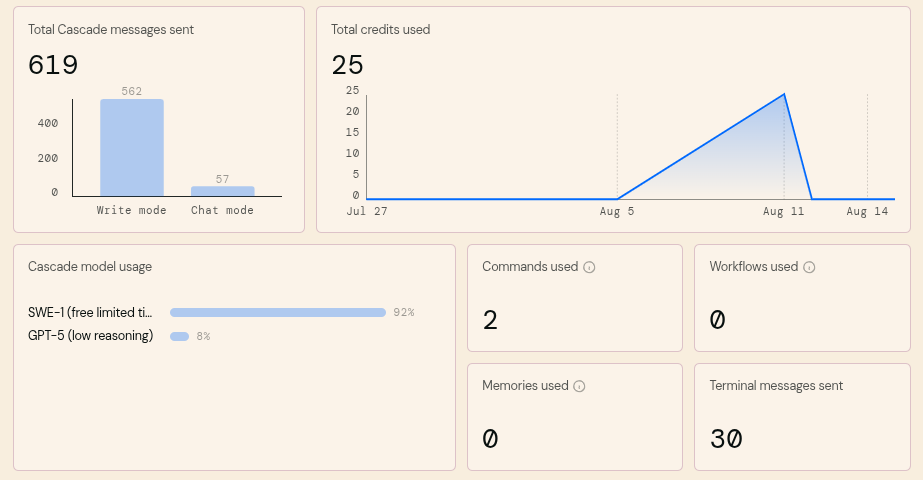

# 🤖 Interacciones con la Inteligencia Artificial

## 🔗 Links

* 📄 [README.md](./README.md) → Documentación principal del Proyecto.
* 📄 [DOCUMENTACION.md](./DOCUMENTACION.md) → Documentación detallada de rutas, casos de uso y ejemplos.

---

## 📑 Índice

1. [Introducción](#introducción)  
2. [Objetivos de la IA](#objetivos-de-la-ia)  
3. [Casos de Uso](#casos-de-uso)  
4. [Limitaciones](#limitaciones)  
5. [Agentes AI utilizados](#agentes-ai-utilizados)

---

## 🔹Introducción

La IA en este proyecto se utiliza como un **Asistente Inteligente** que apoya en la interpretación de datos, automatización de procesos y generación de documentación.
Este **Asistente Inteligente** , en nuestro caso **Winsurf** se utilizó como colega en "Pair Programming" (Driver - Navigator) ayudando a resolver las tareas más repetitivas en el código como la refactorización y creación de módulos, clases, repositorios y abtracciones de datos.

> Pair Programming: Es una técnica de desarrollo ágil en la que dos programadores trabajan juntos en una misma computadora

---

## 🔹Objetivos de la IA

- Interpretar consultas del usuario.  
- Automatizar generación de documentación.  
- Responder preguntas técnicas.  
- Sugerir mejoras en arquitectura y código.
- Refactorizar el código mediante iteraciones.

---

## 🔹Casos de Uso

- Generación automática de documentación técnica.  
- Apoyo en debugging de procesos.  
- Explicaciones de código o arquitectura.  
- Recomendaciones de optimización.

---

## 🔹Limitaciones

- Apoyo de Agentes AI gratis (Respuestas con más errores y requieren más supervisión y revisión)
- Latencia en las respuestas al interactuar en modo "Pair Programming" (Las iteraciones con la AI son propensas a romper el flujo de programación) 

---

## 🔹Agentes AI utilizados

- [Winsurf](https://windsurf.com/)
- [Warp](https://www.warp.dev/)

